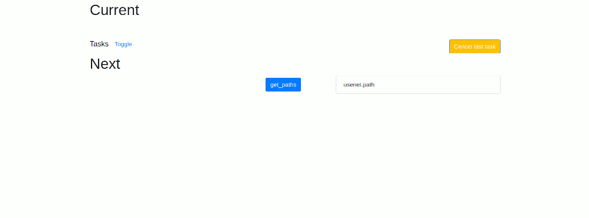

# Frame Tasks

Utility for performing tasks on dataframes.

 Screenshots


## Requires

Use `pip install .` on a clone of this repo to install.

For using the UI, a message queue is required that can work with Celery (i.e. RabbitMQ).

## Application - Python

An ETL pipeline has several tasks to be performed in a certain order. 
As the number of tasks increase, plumbing all of the tasks together
becomes quite challenging. With frame_tasks, it will be much easier
to automatically (or visually with UI) do the plumbing required, based on
the end goal.

First, we define a task that generates the paths to source data:

```python
import frame_tasks as tada

@tada.new_task()
@tada.makes(["usenet.path"], appends=False)
@tada.close_task()
def paths(expects, **kwargs):
    return pd.Series(
        list(glob.glob("20_newsgroups/*/*")), name=expects[0][1]
    ).to_frame()
```

We create another task that reads a file into the dataframe, given the path:


```python
@tada.new_task()
@tada.requires([pat(r"(.*)\.path")], arg="x")
@tada.makes([r"{x}.read_file.multiline"])
@tada.close_task()
def text(x, expects, **kwargs):
    inp = x[x.columns[0]]
    out = inp.apply(lambda x: open(x, errors="replace").read())
    out.name = expects[0][1]
    return x.join(out).reset_index(drop=True)
```

Now we execute tasks to get data from the usenet dataset:

```python
for res in reversed(tada.Executor([], [["usenet.read_file.multiline"]],)):
    print(res)
    break
```

```bash
(env) > $ python tests/test_usenet.py
  [####################################]  100%
                                usenet.path                         usenet.read_file.multiline
0      20_newsgroups/rec.motorcycles/105149  Newsgroups: rec.motorcycles\nPath: cantaloupe....
1      20_newsgroups/rec.motorcycles/104505  Newsgroups: rec.motorcycles\nPath: cantaloupe....
2      20_newsgroups/rec.motorcycles/103120  Newsgroups: rec.motorcycles\nPath: cantaloupe....
3      20_newsgroups/rec.motorcycles/105008  Newsgroups: rec.motorcycles\nPath: cantaloupe....
4      20_newsgroups/rec.motorcycles/104945  Newsgroups: rec.motorcycles\nPath: cantaloupe....
...                                     ...                                                ...
19992           20_newsgroups/sci.med/59088  Path: cantaloupe.srv.cs.cmu.edu!magnesium.club...
19993           20_newsgroups/sci.med/58942  Newsgroups: sci.med\nPath: cantaloupe.srv.cs.c...
19994           20_newsgroups/sci.med/58796  Newsgroups: sci.med\nPath: cantaloupe.srv.cs.c...
19995           20_newsgroups/sci.med/58774  Path: cantaloupe.srv.cs.cmu.edu!crabapple.srv....
19996           20_newsgroups/sci.med/58901  Newsgroups: sci.med\nPath: cantaloupe.srv.cs.c...

[19997 rows x 2 columns]
```

With more tasks defined in `frame_tasks/basic_tasks.py`, we get:

```python
for res in reversed(tada.Executor([], [["usenet.read_file.lines.clean_tokens.top90"]],)):
    print(res)
    break
```

```bash
env) > $ python tests/test_usenet.py
  [####################################]  100%          
        usenet.read_file.lines.clean_tokens.top90
0                                      newsgroups
1                                             rec
2                                     motorcycles
3                                            path
4                                      cantaloupe
...                                           ...
7228476                                    matter
7228477                                    robert
7228479                                    ottawa
7228480                                   ontario
7228481                                    canada

```


## Application - UI

To use the UI, create a script.py with more tasks:

```python
import frame_tasks as tada
from frame_tasks import task_view_app, executor

...
```

Start a celery worker:

```bash
CELERY_BROKER_URL="amqp://..." celery -A script.executor worker
```

Start the ui:

```bash
CELERY_BROKER_URL="amqp://..." FLASK_APP=script.py flask run --port=5000
```

Browse the url `http://localhost:5000/explore`

